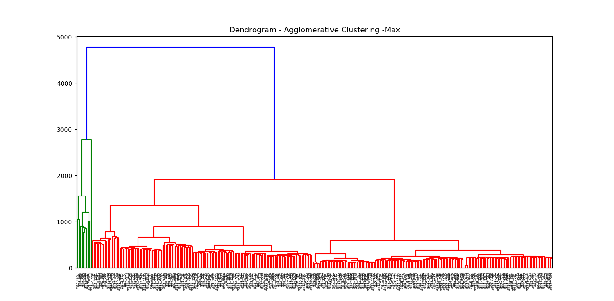
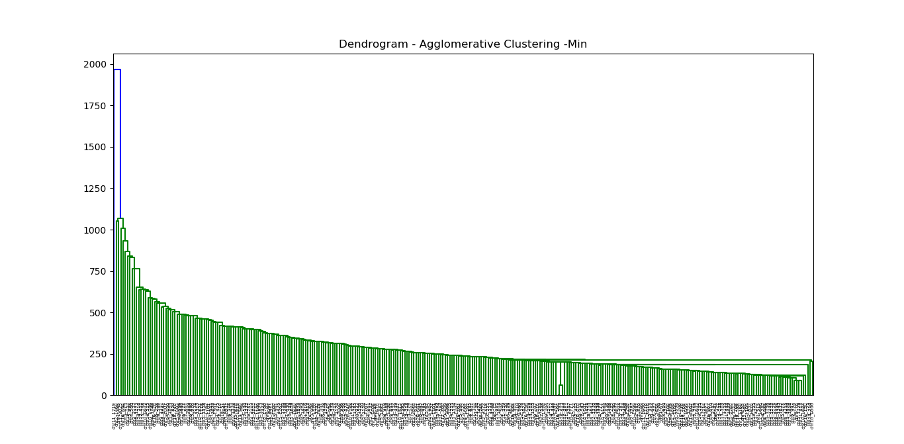
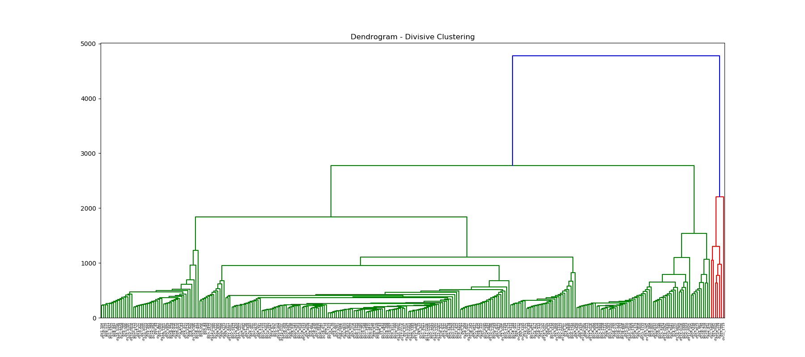

# Agglomerative and Divisive Hierarchical Clustering

## Table of contents
- [Introduction](#introduction)
- [Data](#data)
- [Instructions to run the scripts](#instructions-to-run-the-scripts)
  - [Divisive clustering](#divisive-clustering)
  - [Agglomerative clustering](#agglomerative-clustering)
- [Equations used](#equations-used)
- [Pre-processing done](#pre-processing-done)
- [Results](#results)
  * [Agglomerative](#agglomerative)
  * [Divisive](#divisive)
- [Group Members](#group-members)

<small><i><a href='http://ecotrust-canada.github.io/markdown-toc/'>Table of contents generated with markdown-toc</a></i></small>

---

## Introduction
Hierarchical clustering is a method of cluster analysis which seeks to build a hierarchy of clusters. Strategies for hierarchical clustering generally fall into two types:

1. **Agglomerative**: This is a "bottom up" approach: each observation starts in its own cluster, and pairs of clusters are merged as one moves up the hierarchy.

2. **Divisive**: This is a "top down" approach: all observations start in one cluster, and splits are performed recursively as one moves down the hierarchy.

In general, the merges and splits are determined in a greedy manner. The results of hierarchical clustering are usually presented in a dendrogram.

**The main purpose of this project is to get an in depth understanding of how the Divisive and Agglomerative hierarchical clustering algorithms work.**

*More on [Hierarchical clustering](https://en.wikipedia.org/wiki/Hierarchical_clustering)*

---

## Data
We used the **Human Gene DNA Sequence** dataset, which can be found [here](http://genome.crg.es/datasets/ggalhsapgenes2005/hg16.311.putative.cds.fa). The dataset contains **311 gene sequences**. The data can be found in the folder **'data'**.

---

## Instructions to run the scripts
Run the following command:

##### Divisive clustering
```python
python divisive.py


## Equations used
```
Maximum or complete-linkage clustering -> Max(d(a,b))
Minimum or single-linkage clustering -> Min(d(a,b))
Mean or average linkage clustering -> sum of all d(a,b)/(|A|+|B|)
Diameter of a cluster -> Max(d(x,y))
```
*where x, y are points in the same cluster and, a belongs to A, b belongs to B.*

## Pre-processing done
The file was read sequence by sequence and was saved in the form of a dictionary, where the key is the gene sequence's name and the value contains the entire gene string.

A mapping was created from the unique gene sequences in the dataset to integers so that each sequence corresponded to a unique integer.

The entire data was mapped to integers to reduce the storage and computational requirement.

## Results

CLustering was performed using the agglomerative and divisive methods and the following dendrograms were obtained-

### Agglomerative





### Divisive



## Contributor: 
[Sudheer Chowdary Pulapa](https://github.com/sudheerpulapa)

